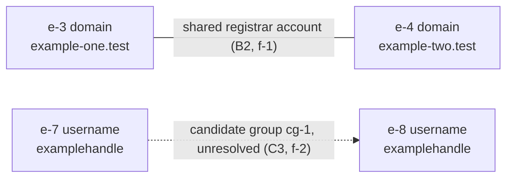

# `<case_id>` — <one-line title, no target name if the target is a private individual>

*Copy this file to `cases/<slug>/report/`. Fill every section. A section with nothing in it says
so explicitly and says why — deleting it hides a gap. Delete the italic instruction lines as you
fill each section. Delete nothing else.*

---

## 1. Header

*Copy verbatim from `scope.md`. If a value differs from `scope.md`, `scope.md` is right and this
report is wrong.*

| Field | Value |
|---|---|
| Case id | `<case_id>` |
| Requester | `<name or role, organization>` |
| Purpose | `<security \| journalism \| kyc \| self_audit \| education>` |
| Authority | `<engagement letter / assignment / mandate / self>` + `<reference>` |
| Jurisdiction | `<requester>` / `<target>` |
| Period covered | `<earliest>..<latest>` or `no time bound` |
| Collection window | `<first ledger ts>..<last ledger ts>` |
| Analyst | `<name or handle>` |
| Classification / handling | `<label>` |
| Report version | `<n>`, `<ISO8601Z>` |

**Handling caveat.** *State who may read this, what they may do with it, and what happens on
redistribution. One paragraph, no legal boilerplate the requester will not read.*

`<This report contains information collected from public sources under the authority named above.
It is <classification> and intended for <share_with>. Do not redistribute outside that group
without written agreement from the requester. Findings are graded; ungraded assertions do not
appear in this document. Nothing here is a legal determination, and nothing here is investment,
compliance, or legal advice.>`

---

## 2. Bottom Line Up Front

*Under 150 words. The answer to the scope question, not a summary of the work. Estimative wording
only: `almost no chance`, `very unlikely`, `unlikely`, `roughly even chance`, `likely`,
`very likely`, `almost certain`. Every sentence carries a grade in parentheses or cites a finding
id that does. If a decision-maker reads only this section, they must not be misled by anything in
it. Write it last.*

`<BLUF text.>`

**Confidence in the BLUF as a whole:** `<Admiralty grade>` — *the weakest link in the chain that
supports it, not an average.*

**What would change this assessment:** *one sentence, the single observation most likely to
overturn the BLUF.*

---

## 3. Scope and authority as recorded

*Reproduce the recorded scope, do not restate it more favourably. Include the out-of-bounds list
in full: a reader must be able to tell what was never looked at.*

**Questions asked**

| # | Question | Status |
|---|---|---|
| Q1 | `<verbatim from scope.md>` | `answered \| partial \| unanswered \| unanswerable` |

**Decision this supports:** `<verbatim from scope.md>`

**Out of bounds** *— declared at intake, enforced throughout.*

```
<list, verbatim from scope.md section 6>
```

**Active collection:** `<active_allowed: yes|no>`. *If yes, list the techniques actually used and
the date each was authorized. If no, state that all collection was passive and mean it.*

**Scope amendments:** *each amendment with its timestamp and who authorized it, or `none`.*

---

## 4. Methodology and limitations

*What was done, in enough detail that another analyst could repeat it. Then what was not done.
The second half is the part that protects the reader.*

**Sources consulted** *— by class, not an exhaustive list; the full list is section 11.*

| Class | Sources used | Passive/active | Coverage caveat |
|---|---|---|---|
| `<infra \| identity \| corporate \| geoint \| media \| crypto \| code \| transport \| search \| archive \| breach \| sanctions>` | | | `<jurisdictions, eras, or languages this class does not cover>` |

**Collection sequence** *— the pivot path, one line per hop: selector in, source, selector out.*

```
<type>:<value> -> <source> -> <type>:<value>
```

**Not collected, by design** *— PII minimization is a feature of this report. State it plainly; a
reader who does not know what was withheld cannot judge what remains.*

| Not collected | Why |
|---|---|
| `<data class>` | `out of bounds per scope.md \| not necessary to answer the question \| no lawful basis \| notifies the target` |

**Limitations** *— name each one and what it does to the findings, not a generic disclaimer.*

| Limitation | Effect on findings |
|---|---|
| `<source coverage gap, language, paywall, deleted content, single-source dependency, time box>` | `<which findings are capped at which grade because of it>` |

**Identity resolution** *— how entities were merged, and what was left open. If any candidate
group is unresolved, say so here as well as in section 10.*

---

## 5. Key findings

*One block per finding, copied from `findings.md` with nothing added and nothing smoothed. Order
by importance to the decision, not by collection order. A finding whose `answers` field is empty
does not belong in this report. Every block keeps its `disconfirms` line — that line is the
difference between analysis and assertion.*

### f-`<n>` — `<label>`

```
claim:      <one sentence>
grade:      <A-F><1-6>
rung:       <observed | reported | correlated | inferred>
estimative: <ICD 203 phrase, or "none" if the claim is not probabilistic>
answers:    Q<n>
entities:   <e-<n>, ...>
mode:       <passive | active>
handling:   <none | partial | withheld>

sources:
  1. <source name>
     url:       <exact URL, redacted only if the URL itself is sensitive>
     retrieved: <ISO8601Z>
     sha256:    <hex64>
     source_grade: <A-F>

reasoning:  <two or three sentences>

alternatives:
  - <competing explanation> — rejected because <reason>

disconfirms: <what would make this wrong>
```

*Repeat per finding. Withheld findings still appear, with the claim replaced by
`[withheld — <reason>]` and every other field intact.*

---

## 6. Entity dossiers

*One subsection per entity that carries a finding. Entities with no findings stay in
`entities.jsonl` and out of the report. Redact per the handling rules at the end of this
template: partial redaction is the default for any natural person.*

### `<e-n>` — `<type>`: `<value or redacted form>`

| Field | Value |
|---|---|
| Type | `<canonical selector type>` |
| Value | `<normalized value, redacted per handling>` |
| First seen in case | `<ISO8601Z>` |
| Grade | `<A-F><1-6>` |
| Rung | `<observed \| reported \| correlated \| inferred>` |
| Candidate group | `<cg-n>` or `none` |
| Findings | `<f-n, f-n>` |
| Attributed to | `<e-n>` or `not attributed` |

*Two or three sentences: what this entity is, what it is doing in this case, and what remains
uncertain about it. No narrative arc, and no motive attributed to a person on inferred evidence.*

---

## 7. Timeline

*From `events.jsonl`. Every row carries its precision. Never render an `approx` value as a precise
time. Rows with `precision: year` sort at the start of that year and are labelled as such.*

| When | Precision | Entity | Event | Grade | Rung | Source |
|---|---|---|---|---|---|---|
| `<ts>` | `<exact \| day \| month \| year \| approx>` | `<e-n>` | `<one sentence, no interpretation>` | | | `<f-n or url>` |

*If the timeline has gaps that matter, say where and why below, rather than letting adjacency
imply continuity.*

---

## 8. Link chart

*Placeholder. Generate from `entities.jsonl` + `events.jsonl` and paste the diagram source here so
the chart travels with the report and stays regenerable. Nodes are entity ids with types; edges
are named relationships with grades. Unresolved candidate groups are drawn as dashed edges and
must never be drawn as merged nodes.*

*Example — delete this block and paste the generated chart.*



*Legend: solid edge = graded relationship with a finding id. Dashed edge = candidate group, not a
merge. Every edge label carries a grade and a finding id, or the edge is removed.*

---

## 9. Alternative hypotheses considered

*The hypotheses that were tested and rejected, and what rejected them. A report with no rejected
hypotheses did not do analysis, it did collection. Include any hypothesis that remains live but
unfavoured, with its estimative wording.*

| # | Hypothesis | Status | Basis | Findings that bear on it |
|---|---|---|---|---|
| H1 | `<the leading hypothesis, stated so that it could fail>` | `favoured` | `<evidence that survives>` | `<f-n>` |
| H2 | `<competing explanation>` | `rejected` | `<the specific observation that rejects it>` | `<f-n>` |
| H3 | `<competing explanation>` | `live, <estimative phrase>` | `<why it cannot be ruled out>` | `<f-n>` |
| H4 | `<deception or planted-evidence hypothesis>` | `<status>` | `<basis>` | `<f-n>` |

*H4 is not optional in an adversarial context: state whether the evidence could have been placed
deliberately, and what would show that.*

---

## 10. Gaps and recommended next collection

*From `gaps.md`. Negative results belong here as results, not as silence. A gap stated plainly is
worth more to the reader than a page of hedged prose.*

**Checked, found nothing**

| Selector | Source | When | Coverage | Meaning of absence |
|---|---|---|---|---|
| `<type>:<value>` | `<source>` | `<ISO8601Z>` | `<yes \| partial \| no \| unknown>` | `<informative \| uninformative>` |

*Coverage `no` or `unknown` means the absence says nothing about the target. Put that in the row,
not in a footnote.*

**Unresolved identities**

| Candidate group | Members | What they share | Datapoint that would resolve it |
|---|---|---|---|
| `<cg-n>` | `<e-n, e-n>` | | |

**Open questions**

| Scope Q | Status | What is missing |
|---|---|---|
| `Q<n>` | `answered \| partial \| unanswered \| unanswerable` | `<the specific datapoint that would close it>` |

**Recommended next collection** *— ranked, each row naming the question it closes.*

| # | Action | Closes | Mode | Notifies target | Cost | Authority needed |
|---|---|---|---|---|---|---|
| r-1 | | `Q<n>` | `passive \| active` | `yes \| no` | `free \| free_key \| paid: <amount> \| analyst hours: <n>` | `none \| account \| scope amendment \| legal review` |

**Not recommended** *— what was deliberately not proposed, so nobody proposes it later assuming it
was overlooked.*

---

## 11. Evidence appendix

*Every artifact any finding rests on. The hash is of the exact bytes in `evidence/`. A finding
citing a hash absent from this table is not deliverable.*

| # | sha256 | Source name | URL | Retrieved (UTC) | Mode | Bytes | Cited by |
|---|---|---|---|---|---|---|---|
| 1 | `<hex64>` | | | | `passive \| active` | | `<f-n>` |

**Artifacts that could not be archived** *— with the reason, and any third-party archive URL.*

| Source | URL | Why no snapshot | Third-party archive |
|---|---|---|---|
| `<source>` | `<url>` | `<robots exclusion \| paywall \| deleted before capture \| login wall>` | `<archive.org url, or none>` |

---

## 12. Source reliability summary

*Per source, not per finding. This is where a reader decides how much of the report to believe
without re-reading it. Grade each source as it behaved in this case, not by reputation.*

| Source | Class | Reliability | Basis for that grade | Findings resting on it | Sole support for |
|---|---|---|---|---|---|
| `<name>` | `<class>` | `<A-F>` | `<primary register \| established aggregator \| unattributed \| single-operator site \| no basis to assess>` | `<f-n, f-n>` | `<f-n, or none>` |

*The `Sole support for` column is the single-point-of-failure list. Any finding above `C3` that
appears there needs either corroboration or a downgrade before delivery.*

**Grade distribution** *— one line, so the shape of the report is visible at a glance.*

```
A1-B2: <n>   A3-B3: <n>   C1-C3: <n>   D1-F3: <n>   any digit 4-6: <n>   rung speculated (must be 0): <n>
```

---

## Handling and redaction note

*Fill this even when nothing was redacted. "Nothing was redacted, and here is why that was
appropriate" is a defensible statement; silence is not.*

| Field | Value |
|---|---|
| Redaction default applied | `<full \| partial \| identifiers-withheld>` |
| Redaction performed by | `<name>` at `<ISO8601Z>` |
| Unredacted copy location | `<case dir path>` — *never attached to the deliverable* |
| Recipients | `<share_with from scope.md>` |
| Retention | `<how long, who deletes>` |

**What redaction looks like in this report**

- Natural-person identifiers are masked in the body and held in the case directory:
  `j****@example.test`, `+1 415 *** ##67`, house number removed from an address, exact
  coordinates reduced to a named locality.
- An entity id is never redacted. `e-7` stays `e-7` in every section, so the report remains
  internally traceable without exposing the value.
- A withheld finding keeps its id, grade, rung, and `disconfirms` line, and replaces the claim
  with `[withheld — <reason>]`.
- Evidence hashes are never redacted. A hash is not personal data, and it is the integrity chain.
- Redaction applies to the delivered copy only. `findings.md` and `evidence/` keep the full values
  under the retention rule above.

**Minors and third parties.** *State explicitly that no minor was a target, and that incidental
third parties encountered during collection were not pursued or recorded beyond what a finding
required. If either is untrue, this report is not deliverable.*

---

## Pre-delivery checklist

*Every box ticked, or the report does not go out. Run this against the finished document, not from
memory.*

```
[ ] Every sentence in sections 2, 5, 6, 7 and 9 is graded or cites a graded finding id
[ ] No banned word appears: clearly, obviously, proves, definitely, confirmed (unless digit 1)
[ ] Every probabilistic sentence uses one of the seven ICD 203 phrases and no synonym
[ ] BLUF is under 150 words and is not contradicted anywhere below it
[ ] Every finding has at least one source with url + retrieved + sha256
[ ] Every hash cited appears in section 11 and exists in evidence/
[ ] Every finding keeps its disconfirms line
[ ] Every scope question appears in section 3 with a status
[ ] No finding answers a question that is not in scope.md
[ ] Section 4 states what was not collected and why
[ ] Every unresolved candidate group is in section 10 and is not merged anywhere in the report
[ ] No approx-precision event is rendered as a precise time
[ ] The redaction default from scope.md was actually applied
[ ] Header values match scope.md exactly
[ ] Active collection, if any, is listed with its authorization date
[ ] Section 8 contains the generated chart, not the template example
[ ] Negative results present with coverage on every row
[ ] Audience emphasis applied for the declared purpose
[ ] JSON export, if produced, validates and carries the same redaction
```
